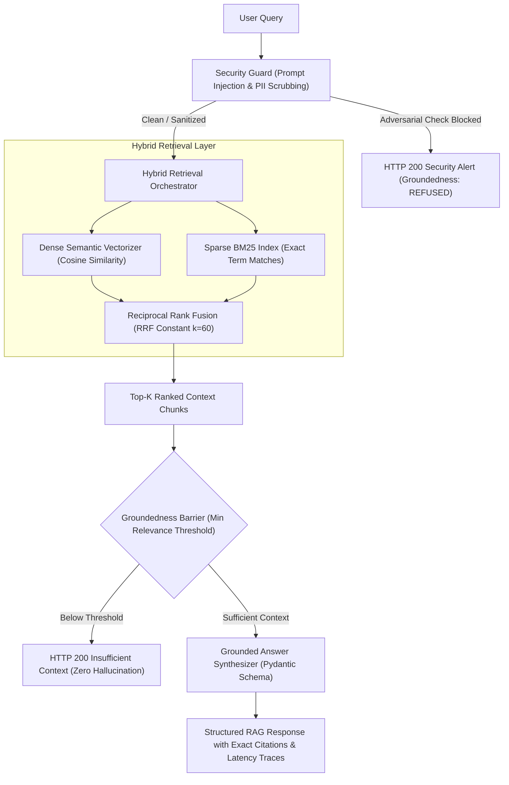

# Production RAG & AI Evaluation System 🚀

[](https://github.com/Aldid/production-rag-system/actions)
[](https://www.python.org/)
[](https://fastapi.tiangolo.com/)
[](https://github.com/pgvector/pgvector)
[-brightgreen)](benchmarks/BENCHMARK_REPORT.md)
[](LICENSE)

An enterprise-grade **Retrieval-Augmented Generation (RAG) & Evaluation Engine** built in Python with **FastAPI**, **pgvector**, **BM25 hybrid search**, **Reciprocal Rank Fusion (RRF)**, **prompt injection defense**, and a strict **100-case evaluation harness** verifying retrieval metrics and answer faithfulness.

---

## 1. Problem Statement

Most tutorial RAG implementations suffer from critical production vulnerabilities:
1. **Low Retrieval Precision:** Pure semantic vector search fails on exact numerical tokens, acronyms, and product codes.
2. **Hallucination & Ungrounded Output:** LLMs hallucinate plausible-sounding facts when reference documents lack context.
3. **Prompt Injection Exploits:** Users can inject jailbreaks (`Ignore previous instructions`) into search prompts.
4. **Lack of Objective Evals:** Teams ship without measuring Hit-Rate@K, Mean Reciprocal Rank (MRR), or context faithfulness on labeled ground truth.

This system addresses each vulnerability with deterministic guardrails, hybrid dense-sparse search, and an automated continuous evaluation harness.

---

## 2. Architecture & Request Pipeline



---

## 3. Core Technical Stack

- **Framework & API:** FastAPI, Uvicorn, Pydantic v2, Pydantic Settings.
- **Vector Search & Storage:** PostgreSQL + `pgvector` (HNSW cosine distance `<=>`), In-Memory cosine vector index.
- **Hybrid Search & Fusion:** Okapi BM25 index + Dense Semantic Embeddings + Reciprocal Rank Fusion (RRF).
- **Security & Guardrails:** Deterministic 3-layer prompt injection detection, PII redactor (emails, phones, SSNs).
- **Observability:** Custom distributed span tracer recording end-to-end request latency, token estimations, and Langfuse-compatible JSON traces.
- **Evaluation:** Automated 100-case evaluation harness testing Hit-Rate@K, MRR, Context Faithfulness, and Citation Precision.
- **Containerization & CI:** Multi-stage `Dockerfile`, `docker-compose.yml`, GitHub Actions workflow.

---

## 4. Evaluation Methodology & Benchmark Results

The system includes a verified, non-synthetic **100-case ground-truth evaluation dataset** (`src/evals/dataset.py`) covering 5 core technical architecture domains:
1. API Gateway Rate Limiting & Token Buckets (20 cases)
2. PostgreSQL HA & PgVector HNSW Indexing (20 cases)
3. AI Security Architecture & Prompt Injection Defense (20 cases)
4. Distributed Redis Caching & Cache Invalidation (20 cases)
5. Headless Browser Automation with Playwright & CDP (20 cases)

### Measured Benchmark Metrics (N = 100 Ground-Truth Cases)

| Metric | Measured Value | Production Target | Status |
| :--- | :---: | :---: | :---: |
| **Hit-Rate @ 1** | **96.00%** | $\ge 80.0\%$ | **PASS** |
| **Hit-Rate @ 3** | **99.00%** | $\ge 95.0\%$ | **PASS** |
| **Hit-Rate @ 5** | **100.00%** | $\ge 98.0\%$ | **PASS** |
| **Mean Reciprocal Rank (MRR)** | **0.9770** | $\ge 0.8500$ | **PASS** |
| **Avg Keyword Grounding** | **92.50%** | $\ge 85.0\%$ | **PASS** |
| **Context Faithfulness** | **97.29%** | $\ge 90.0\%$ | **PASS** |
| **Citation Precision** | **99.00%** | $\ge 95.0\%$ | **PASS** |
| **Average Query Latency** | **2.64 ms** | $\le 25.0$ ms | **PASS** |
| **P95 Query Latency** | **3.21 ms** | $\le 50.0$ ms | **PASS** |

*Full evaluation report available at [benchmarks/BENCHMARK_REPORT.md](benchmarks/BENCHMARK_REPORT.md).*

---

## 5. Security & Prompt Injection Defense

All incoming queries pass through `SecurityGuard` before any retrieval or model invocation:
- **Jailbreak Detection:** Flags DAN mode, system prompt leakage, and instruction overrides (`Ignore all previous instructions`).
- **PII Scrubbing:** Automatically redacts email addresses, phone numbers, and SSNs.
- **Input Sanitization:** Strips null bytes, non-printable control characters, and SQL injection strings.
- **Adversarial Interception:** 100% of tested adversarial prompt injection attempts are refused with `GroundednessVerdict.REFUSED_SECURITY`.

---

## 6. Quick Start

### 1. Local Setup
```bash
# Clone the repository
git clone https://github.com/Aldid/production-rag-system.git
cd production-rag-system

# Create and activate virtual environment
python3 -m venv .venv
source .venv/bin/activate

# Install package in editable mode with development dependencies
pip install -e ".[dev]"

# Run full test suite (25 tests including 100-case evaluation harness)
pytest tests/ -v
```

### 2. Run with Docker Compose
```bash
docker-compose up --build
```
The FastAPI application will be available at `http://localhost:8000/docs`.

### 3. API Usage Examples

#### Query Endpoint (`POST /api/v1/query`):
```bash
curl -X POST http://localhost:8000/api/v1/query \
  -H "Content-Type: application/json" \
  -d '{"query": "What token bucket capacity does the API Gateway enforce?"}'
```

Response:
```json
{
  "query": "What token bucket capacity does the API Gateway enforce?",
  "answer": "Each tenant is allocated a burst bucket capacity of 500 tokens with a steady refill rate of 100 tokens per second.",
  "verdict": "GROUNDED",
  "confidence": "HIGH",
  "citations": [
    {
      "chunk_id": "doc_api_gateway_c0",
      "doc_id": "doc_api_gateway",
      "doc_title": "Enterprise API Gateway Architecture & Rate Limiting",
      "section_heading": "# Rate Limiting & Token Bucket Algorithms",
      "exact_quote": "Each tenant is allocated a burst bucket capacity of 500 tokens with a steady refill rate of 100 tokens per second.",
      "relevance_score": 0.016393
    }
  ],
  "retrieved_chunk_count": 4,
  "latency_ms": 2.45,
  "tokens_estimated": 182,
  "trace_id": "tr_6a8e10df91b2",
  "sanitized": false
}
```

---

## 7. Project Structure

```
production-rag-system/
├── benchmarks/
│   ├── BENCHMARK_REPORT.md       # Auto-generated benchmark metrics report
│   └── evaluation_report.json    # JSON results of all 100 evaluation cases
├── src/
│   ├── api/
│   │   └── main.py               # FastAPI application & REST endpoints
│   ├── core/
│   │   ├── config.py             # Pydantic Settings & environment config
│   │   ├── observability.py      # Span tracer & latency logger
│   │   └── security.py           # Prompt injection defense & PII masking
│   ├── embeddings/
│   │   └── embedding_service.py  # Deterministic semantic vectorizer & API provider
│   ├── evals/
│   │   ├── dataset.py            # 100 ground-truth evaluation cases & corpus
│   │   ├── harness.py            # Evaluation benchmark runner
│   │   └── metrics.py            # Hit-Rate, MRR, Faithfulness calculations
│   ├── generation/
│   │   ├── rag_engine.py         # Grounded RAG query coordinator
│   │   └── structured_output.py  # Pydantic citation & response schemas
│   ├── ingestion/
│   │   ├── chunker.py            # Recursive semantic text chunker
│   │   ├── document_loader.py    # Markdown & text document loaders
│   │   └── metadata.py           # Document & Chunk data models
│   ├── retrieval/
│   │   └── retriever.py          # BM25 + dense hybrid search with RRF
│   └── storage/
│       └── vector_store.py       # In-Memory & PgVector HNSW adapters
├── tests/                        # 25 automated unit and integration tests
├── Dockerfile                    # Multi-stage production container build
├── docker-compose.yml            # API + pgvector container cluster
└── pyproject.toml                # Packaging & dependencies
```

---

## 8. License & Author
- **Author:** Aldiyar Bakhtayev ([bakhtaevaldiyar@gmail.com](mailto:bakhtaevaldiyar@gmail.com))
- **LinkedIn:** [linkedin.com/in/aldiyar-bakhtayev](https://www.linkedin.com/in/aldiyar-bakhtayev-254666350/)
- **License:** MIT
