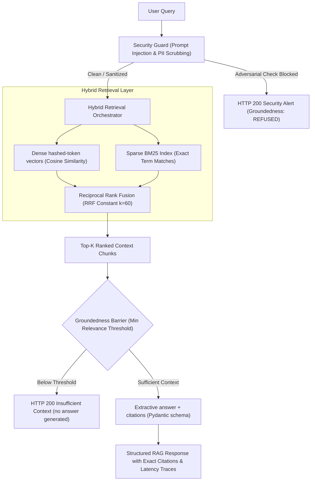

# RAG & Evaluation System (portfolio project)

[](https://github.com/Aldid/production-rag-system/actions)
[](https://www.python.org/)
[](https://fastapi.tiangolo.com/)
[](benchmarks/BENCHMARK_REPORT.md)
[](LICENSE)

A small, fully offline **Retrieval-Augmented Generation (RAG) pipeline with an evaluation harness**, built in Python with **FastAPI**. It combines **BM25** and a dense vector index with **Reciprocal Rank Fusion (RRF)**, adds regex-based **prompt-injection and PII checks**, returns answers with **citations**, and ships a **100-question evaluation harness** (Hit-Rate@K, MRR, keyword coverage, lexical faithfulness) that runs in CI.

**What it is not (yet):** by default it uses no LLM and no learned embedding model. Embeddings are deterministic feature-hashed tokens, answers are extracted sentences from the retrieved chunks, and the vector store is in-memory. A `PgVectorStore` class exists, but it only emits pgvector DDL and delegates every operation to the in-memory index; nothing connects to PostgreSQL. Setting `OPENAI_API_KEY` (with the `openai` package installed separately) switches embeddings and answer generation to OpenAI calls; that path is not covered by tests or the benchmark.

---

## 1. Problem Statement

Most tutorial RAG implementations suffer from critical production vulnerabilities:
1. **Low Retrieval Precision:** Pure semantic vector search fails on exact numerical tokens, acronyms, and product codes.
2. **Hallucination & Ungrounded Output:** LLMs hallucinate plausible-sounding facts when reference documents lack context.
3. **Prompt Injection Exploits:** Users can inject jailbreaks (`Ignore previous instructions`) into search prompts.
4. **Lack of Objective Evals:** Teams ship without measuring Hit-Rate@K, Mean Reciprocal Rank (MRR), or context faithfulness on labeled ground truth.

This project explores each of these with deterministic guardrails, hybrid sparse + dense retrieval, and an evaluation harness that runs on every CI build.

---

## 2. Architecture & Request Pipeline



---

## 3. Core Technical Stack

- **Framework & API:** FastAPI, Uvicorn, Pydantic v2, Pydantic Settings.
- **Vector Search & Storage:** in-memory cosine index (used everywhere). `PgVectorStore` provides pgvector DDL (HNSW, `vector_cosine_ops`) but no database driver or connection yet.
- **Embeddings:** deterministic feature hashing of words + character tri-grams into 384 dimensions (lexical, not semantic). Optional OpenAI `text-embedding-3-small` when `OPENAI_API_KEY` is set.
- **Hybrid Search & Fusion:** Okapi BM25 + dense cosine search, fused with Reciprocal Rank Fusion (k = 60).
- **Answer generation:** extractive (selects sentences from retrieved chunks) with citations; optional OpenAI chat completion when configured.
- **Security & Guardrails:** 8 regex patterns for prompt-injection / jailbreak / SQL-token attempts (EN + RU), control-character stripping, PII redaction (emails, phones, SSNs).
- **Observability:** in-process span tracer (per-stage latency, token estimate) exposed as JSON via `/api/v1/traces`.
- **Evaluation:** 100-question harness computing Hit-Rate@K, MRR, keyword coverage, lexical faithfulness, citation precision and latency.
- **Containerization & CI:** multi-stage `Dockerfile`, `docker-compose.yml`, GitHub Actions (tests + benchmark on Python 3.11 / 3.12 / 3.13).

---

## 4. Evaluation Methodology & Benchmark Results

The evaluation set in `src/evals/dataset.py` is **self-written**: a corpus of **5 short reference documents** (23 chunks after splitting) and **100 questions** with expected document, keywords and answer, written by the author against those documents. It covers 5 domains:
1. API Gateway Rate Limiting & Token Buckets (20 cases)
2. PostgreSQL HA & PgVector HNSW Indexing (20 cases)
3. AI Security Architecture & Prompt Injection Defense (20 cases)
4. Distributed Redis Caching & Cache Invalidation (20 cases)
5. Headless Browser Automation with Playwright & CDP (20 cases)

### Measured Benchmark Metrics (N = 100 questions, 5 documents)

Output of the CI benchmark step (`EvaluationHarness`), deterministic embeddings, no LLM:

| Metric | Measured Value | CI / test threshold |
| :--- | :---: | :---: |
| **Hit-Rate @ 1** (document level) | **96%** | ≥ 80% |
| **Hit-Rate @ 3** | **99%** | ≥ 95% |
| **Hit-Rate @ 5** | **100%** | ≥ 98% |
| **Mean Reciprocal Rank (MRR)** | **0.977** | ≥ 0.85 |
| **Avg keyword coverage** | **92.5%** | ≥ 80% |
| **Faithfulness (lexical proxy)** | **97.3%** | ≥ 85% |
| **Citation precision** | **99%** | ≥ 90% |
| **Answer relevance (token Jaccard vs. reference answer)** | **13.6%** | none |
| **Average latency per query** | ~1–3 ms (machine-dependent) | < 50 ms |

**How to read these numbers:**
- With only 5 candidate documents, a random ranking already gets about 20% Hit-Rate @ 1, and the questions reuse the documents' wording, which favours lexical retrieval. These numbers show the pipeline works end to end; they are not comparable to public RAG benchmarks.
- "Faithfulness" is the share of answer tokens that also occur in the retrieved context. Because answers are extracted sentences, it is high by construction. It is not an LLM- or human-judged score.
- Answer relevance is low because extracted sentences are much longer than the short reference answers.

*Full evaluation report available at [benchmarks/BENCHMARK_REPORT.md](benchmarks/BENCHMARK_REPORT.md).*

---

## 5. Security & Prompt Injection Defense

All incoming queries pass through `SecurityGuard` before any retrieval or model invocation:
- **Jailbreak Detection:** regex patterns flag DAN mode, system prompt leakage, instruction overrides (`Ignore all previous instructions`, also in Russian) and SQL tokens such as `DROP TABLE`.
- **PII Scrubbing:** redacts email addresses, phone numbers, and SSNs.
- **Input Sanitization:** strips null bytes and non-printable control characters.
- **Adversarial Interception:** the 4 adversarial prompts in `tests/test_security.py` are all flagged. Regex filters are easy to paraphrase around, so this is a first line of defence, not a guarantee.

---

## 6. Quick Start

### 1. Local Setup
```bash
# Clone the repository
git clone https://github.com/Aldid/production-rag-system.git
cd production-rag-system

# Create and activate virtual environment
python3 -m venv .venv
source .venv/bin/activate

# Install package in editable mode with development dependencies
pip install -e ".[dev]"

# Run the test suite (25 tests, including the 100-question benchmark)
pytest tests/ -v
```

### 2. Run with Docker Compose
```bash
docker-compose up --build
```
The FastAPI application will be available at `http://localhost:8000/docs`. The compose file also starts a `pgvector/pgvector` container, but the application does not use it yet (see above).

### 3. API Usage Examples

#### Query Endpoint (`POST /api/v1/query`):
```bash
curl -X POST http://localhost:8000/api/v1/query \
  -H "Content-Type: application/json" \
  -d '{"query": "What token bucket capacity does the API Gateway enforce?"}'
```

Response (real output, abbreviated; the extractive answer includes the section heading):
```json
{
  "query": "What token bucket capacity does the API Gateway enforce?",
  "answer": "## Rate Limiting & Token Bucket Algorithms\n\nThe enterprise API Gateway implements a distributed token bucket rate limiter backed by Redis Cluster. Each tenant is allocated a burst bucket capacity of 500 tokens with a steady refill rate of 100 tokens per second. ...",
  "verdict": "GROUNDED",
  "confidence": "HIGH",
  "citations": [
    {
      "chunk_id": "doc_api_gateway_c2",
      "doc_id": "doc_api_gateway",
      "doc_title": "Enterprise API Gateway Architecture & Rate Limiting",
      "section_heading": "## Rate Limiting & Token Bucket Algorithms",
      "exact_quote": "## Rate Limiting & Token Bucket Algorithms\n\nThe enterprise API Gateway implements a distributed token bucket rate limiter backed by Redis Cluster.",
      "relevance_score": 0.016393
    }
  ],
  "retrieved_chunk_count": 4,
  "latency_ms": 2.22,
  "tokens_estimated": 280,
  "trace_id": "tr_256444c44426",
  "sanitized": false
}
```

---

## 7. Project Structure

```
production-rag-system/
├── benchmarks/
│   ├── BENCHMARK_REPORT.md       # Auto-generated benchmark metrics report
│   └── evaluation_report.json    # JSON results of all 100 evaluation cases
├── src/
│   ├── api/
│   │   └── main.py               # FastAPI application & REST endpoints
│   ├── core/
│   │   ├── config.py             # Pydantic Settings & environment config
│   │   ├── observability.py      # Span tracer & latency logger
│   │   └── security.py           # Prompt injection defense & PII masking
│   ├── embeddings/
│   │   └── embedding_service.py  # Feature-hashing vectorizer + optional OpenAI provider
│   ├── evals/
│   │   ├── dataset.py            # 100 ground-truth evaluation cases & corpus
│   │   ├── harness.py            # Evaluation benchmark runner
│   │   └── metrics.py            # Hit-Rate, MRR, Faithfulness calculations
│   ├── generation/
│   │   ├── rag_engine.py         # Grounded RAG query coordinator
│   │   └── structured_output.py  # Pydantic citation & response schemas
│   ├── ingestion/
│   │   ├── chunker.py            # Recursive semantic text chunker
│   │   ├── document_loader.py    # Markdown & text document loaders
│   │   └── metadata.py           # Document & Chunk data models
│   ├── retrieval/
│   │   └── retriever.py          # BM25 + dense hybrid search with RRF
│   └── storage/
│       └── vector_store.py       # In-memory index; PgVectorStore = DDL + in-memory fallback
├── tests/                        # 25 automated unit and integration tests
├── Dockerfile                    # Multi-stage production container build
├── docker-compose.yml            # API + (currently unused) pgvector container
└── pyproject.toml                # Packaging & dependencies
```

---

## 8. License & Author
- **Author:** Aldiyar Bakhtayev ([bakhtaevaldiyar@gmail.com](mailto:bakhtaevaldiyar@gmail.com))
- **LinkedIn:** [linkedin.com/in/aldiyar-bakhtayev](https://www.linkedin.com/in/aldiyar-bakhtayev-254666350/)
- **License:** MIT
